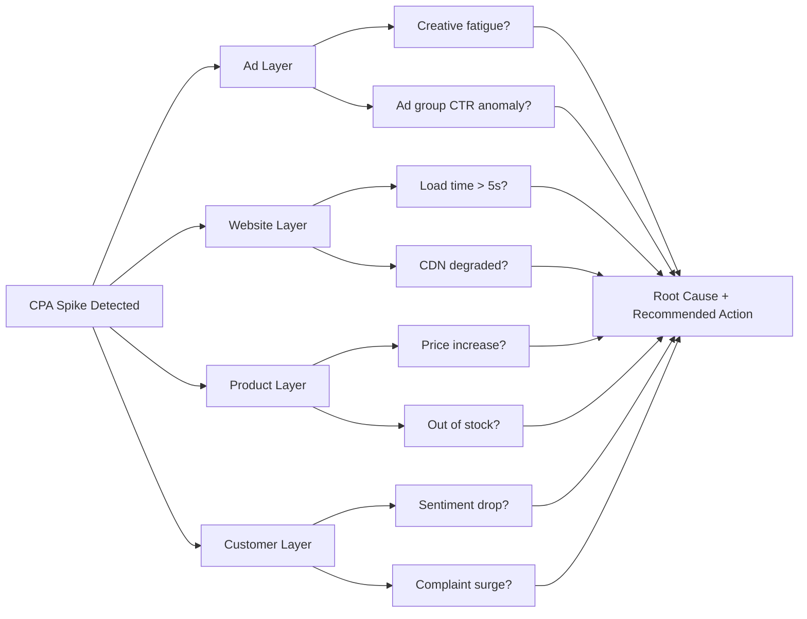
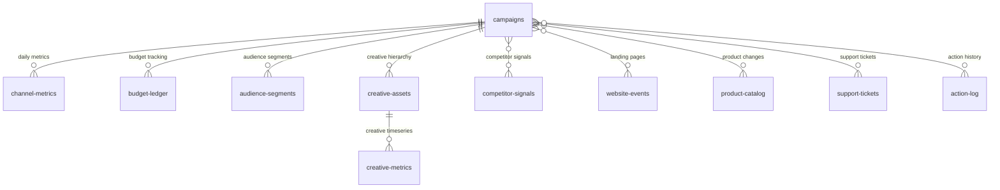

# CampaignPilot

**Multi-Channel Marketing Intelligence Agent powered by Elasticsearch**

CampaignPilot is a marketing intelligence platform that uses Elasticsearch to store and analyze 50 cross-channel advertising campaigns. It automatically detects anomalies (CPA spikes, budget overspend, creative fatigue, etc.), performs cross-system root cause analysis (correlating landing page health, product price changes, support ticket sentiment), and provides conversational AI recommendations.

## Key Features

- **9 Anomaly Types** — CPA spike, CTR drop, budget overspend, creative fatigue, audience churn, competitive threat, landing page failure, product change, support sentiment surge
- **Cross-System Root Cause Analysis** — Automatically correlates signals across ad, website, product, and customer layers to diagnose the true cause of anomalies
- **Conversational AI Agent** — Dual-mode support: Elastic AI Assistant (Kibana Agent Builder) or OpenRouter LLM fallback
- **Interactive Dashboard** — 4-tab Streamlit UI: Campaign Overview, Anomaly Alerts, AI Chat, Action Log
- **14 Agent Tools** — Covering campaign metrics, budget tracking, creative analysis, audience insights, competitor monitoring, and more

## Architecture

### System Architecture

```mermaid
graph TB
    User([User])
    User --> Dashboard[Streamlit Dashboard<br/>4 Tabs]
    User --> CLI[CLI Agent]

    Dashboard --> Agent{AI Agent}
    CLI --> Agent

    Agent -->|Primary| Kibana[Elastic AI Assistant<br/>Kibana Agent Builder]
    Agent -->|Fallback| OpenRouter[OpenRouter LLM]

    Kibana --> Tools[14 ES|QL Tools]
    OpenRouter --> Tools

    Tools --> ES[(Elasticsearch<br/>11 Indices)]

    subgraph Frontend
        Dashboard
        CLI
    end

    subgraph Agent Layer
        Agent
        Kibana
        OpenRouter
    end

    subgraph Data Layer
        Tools
        ES
    end
```

### Cross-System Root Cause Diagnosis



### Data Model



### Project Structure

```
data/           — Data generation & ES index setup
mappings/       — 11 ES index mapping files
tools/          — ES|QL query tools (14 specialized analysis modules)
workflows/      — Multi-step analysis workflows (anomaly scan, campaign health)
agent/          — LLM agent orchestration (dual-mode: Kibana / OpenRouter)
frontend/       — Streamlit Web UI (4-tab dashboard)
```

### Indices (11)

| Index | Description |
|-------|-------------|
| `campaigns` | Campaign metadata (~50 docs) |
| `channel-metrics` | Daily channel-level performance metrics (~2,000+ docs) |
| `creative-assets` | Creative metadata (Campaign → Ad Group → Creative hierarchy) |
| `creative-metrics` | Daily creative-level timeseries with fatigue scores |
| `audience-segments` | Audience segment performance data (~1,500+ docs) |
| `competitor-signals` | Competitive intelligence (~1,000 docs) |
| `budget-ledger` | Daily budget tracking (~2,000+ docs) |
| `action-log` | Agent action history (~50 docs) |
| `website-events` | Landing page performance events (load time, bounce rate, CDN status) |
| `product-catalog` | Product price/stock change events |
| `support-tickets` | Customer support tickets with sentiment scoring |

## Getting Started

### Prerequisites

- Python 3.10+
- Elastic Cloud Serverless deployment (with API key)
- (Optional) Kibana Agent Builder access or OpenRouter API key

### Installation

```bash
git clone https://github.com/EZZEASY/CampaignPilot.git
cd CampaignPilot
pip install -r requirements.txt
```

### Configuration

Copy the environment template and fill in your credentials:

```bash
cp .env.example .env
```

**Required:**
- `ES_HOST` — Elasticsearch host URL
- `ES_API_KEY` — Elasticsearch API key

**Optional:**
- `KIBANA_URL` + `KIBANA_API_KEY` — Enable Kibana Agent Builder mode
- `OPENROUTER_API_KEY` — Enable OpenRouter LLM fallback mode
- `ES_INFERENCE_ID` — Inference endpoint for `semantic_text` fields

### Generate Data & Initialize

```bash
# Generate synthetic data (outputs to data_output/)
python data/generate_all.py

# Create ES indices and bulk-write data
python data/setup_elasticsearch.py

# Verify connection and index status
python data/setup_elasticsearch.py --verify

# (Optional) Set up Agent Builder tools and agent
python data/setup_agents.py
```

### Run

```bash
# Launch Streamlit dashboard
streamlit run frontend/app.py

# Or use the CLI agent
python -m agent.cli
```

## Anomaly Detection

CampaignPilot performs full-spectrum anomaly scanning across 9 alert types:

| Alert Type | Trigger Condition | Example |
|------------|-------------------|---------|
| CPA Spike | CPA week-over-week increase > 30% | CAMP-2026-041 Google Ads CPA from $12 to $18 |
| CTR Drop | CTR week-over-week decline > 25% | Organic search click-through rate plummets |
| Budget Overspend | Spend pace ratio > 1.3 | CAMP-2026-018 TikTok Ads burning budget too fast |
| Creative Fatigue | Fatigue score > 0.85 | CAMP-2026-017 Meta carousel creative overexposed |
| Audience Churn | Churn risk > 0.6 | Female 25–34 segment engagement declining |
| Competitive Threat | Impression share sudden rise | CompetitorAlpha aggressively increasing spend |
| Landing Page Failure | Load time > 5s or timeout rate > 10% | /lp/spring-sale CDN degraded |
| Product Change | Price increase > 15% or out of stock | Widget Pro price up 25% |
| Support Sentiment Surge | Ticket volume spike + sentiment drop | Pricing complaint wave |

### Cross-System Diagnosis Protocol

When a CPA spike is detected, the agent automatically performs root cause analysis across 4 layers:

1. **Ad Layer** — Check creative fatigue, ad group CTR distribution
2. **Website Layer** — Check landing page load time, CDN status, bounce rate
3. **Product Layer** — Check price changes, inventory status
4. **Customer Layer** — Check support ticket sentiment, complaint category distribution

## Agent Tools

| Tool | Function |
|------|----------|
| `query_campaign_metrics` | Query campaign-level aggregate metrics |
| `get_campaign_timeseries` | Retrieve daily metric timeseries |
| `detect_anomalies` | Run full-spectrum anomaly scan |
| `analyze_campaign` | Single-campaign deep health analysis |
| `get_budget_status` | Budget spend progress and alerts |
| `get_creative_performance` | Creative fatigue detection |
| `drill_down_ad_group` | Ad group-level drill-down analysis |
| `get_audience_segments` | Audience segment churn risk |
| `get_competitor_intel` | Competitor threat summary |
| `check_website_health` | Landing page health check |
| `check_product_changes` | Product price/stock changes |
| `analyze_support_sentiment` | Support ticket sentiment analysis |
| `log_action` | Record optimization action |
| `get_action_log` | View action history |

## Tech Stack

- **Storage & Search** — Elasticsearch (Elastic Cloud Serverless)
- **Query Language** — ES|QL
- **AI Agent** — Elastic AI Assistant / OpenRouter + OpenAI SDK
- **Frontend** — Streamlit + Plotly
- **Data Generation** — Faker + custom anomaly injection

## License

MIT License — see [LICENSE](LICENSE)
